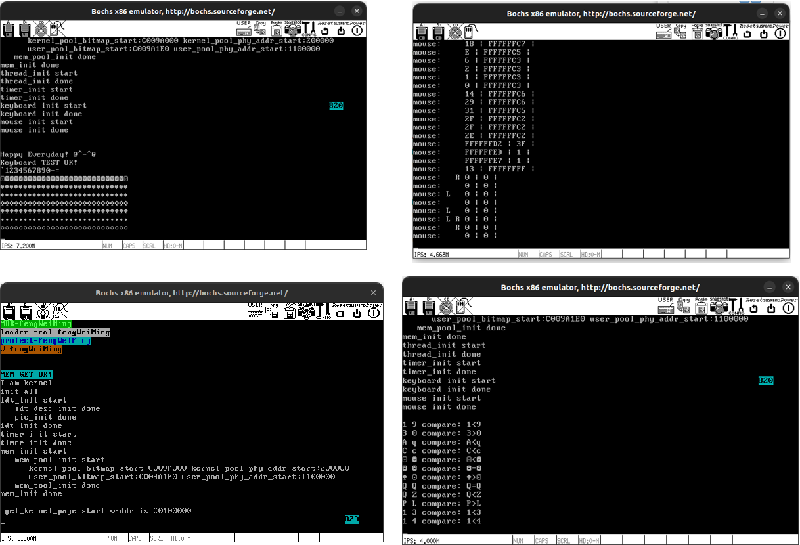

# Operating-System-Labs

## 项目介绍

本项目包含操作系统课程中的实验内容，涵盖了进程管理与通信、操作系统算法、以及操作系统内核设计等方面的实践操作。

## 目录结构

- `chapter-1/`: 进程管理与进程通信

- `chapter-2/`: 操作系统算法实验
  - 该部分实验包括多个经典的操作系统算法：
    - **银行家算法**：确保系统在资源分配过程中不会进入死锁状态。
    - **页面置换算法**：实现页面置换的几种算法，包括 FIFO、LRU 等，模拟内存管理。
    - **磁盘调度算法**：实现磁盘调度的常见算法，模拟磁盘的输入输出调度。
    - **实现 ls 命令**：实现类 Unix 系统中的 `ls` 命令，用于列出目录内容。

- `chapter-3/`: 操作系统内核设计

## 许可证

本项目仅供学习和参考，未经授权请勿用于商业用途或抄袭。
